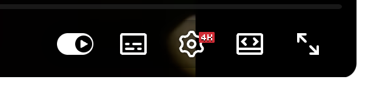
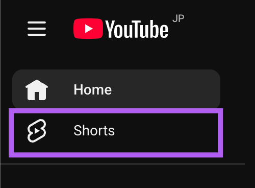
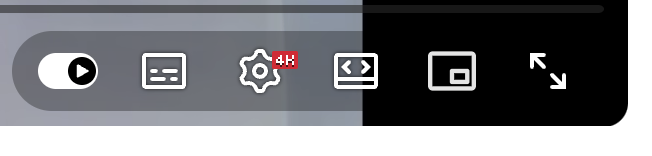
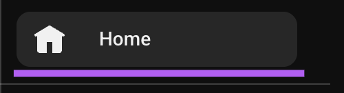

# yt-tools

Chrome extension that restores the YouTube miniplayer button and removes Shorts

## Features

- Automatically adds a miniplayer button to YouTube's video control bar
- I will delete the Shorts from YouTube.
- Toggle on/off via the extension popup
- No data collection or tracking

> [!CAUTION]
> By default, Shorts blocking is disabled. Please enable it manually.

## Screenshots

### Before



### After



## Installation

1. Clone or download this repository
```bash
   git clone https://github.com/fjt-dev/yt-tools
```
2. Open Chrome and navigate to `chrome://extensions/`
3. Enable **Developer mode** (toggle in the top-right corner)
4. Click **Load unpacked** and select the project folder
5. The extension is now active on youtube.com

## Support

Open an issue on GitHub for bugs or suggestions.

---

**Note**: This extension is not affiliated with or endorsed by YouTube or Google, Inc.
